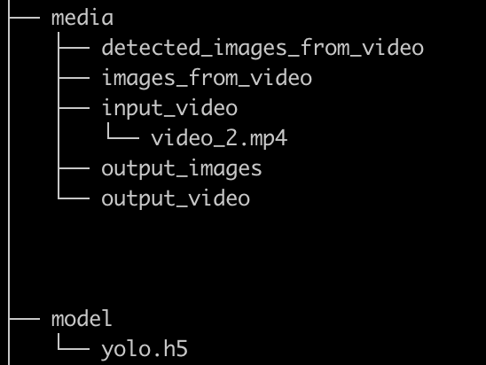
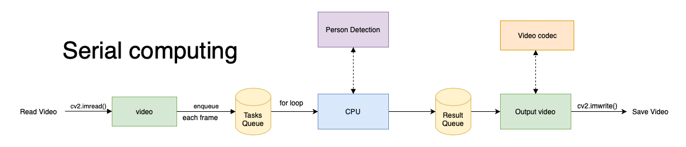
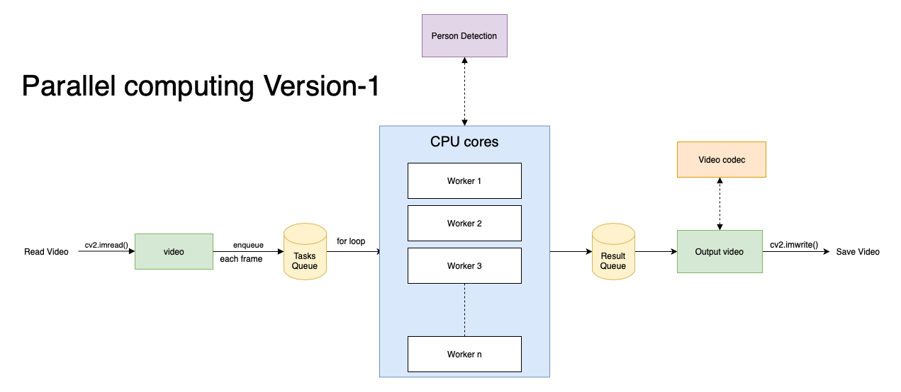
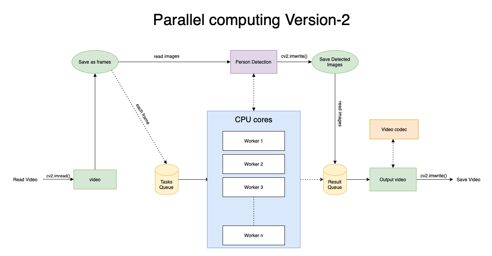
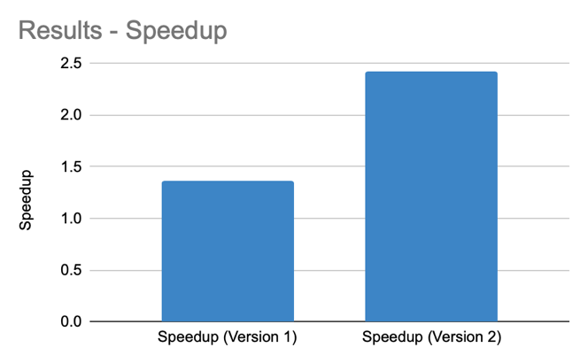
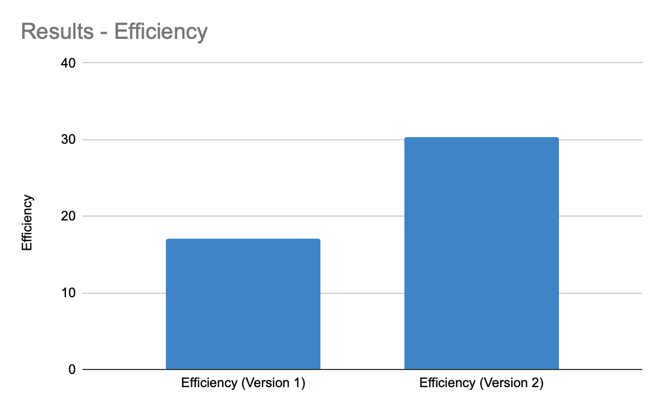
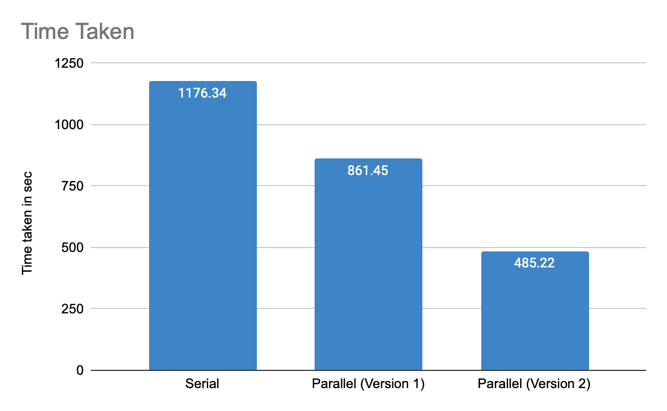
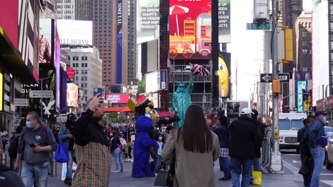
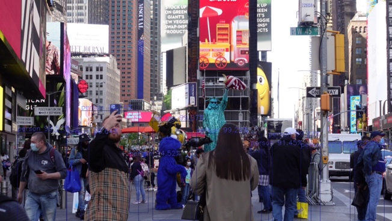

# Person Detection Using Embarrassingly Parallel Computing

This project aims to demonstrate the use of embarrassingly parallel computing techniques for detecting persons in video frames.

# ****Project Overview****

In this project, we will use the parallel processing capabilities of a multi-core processor to speed up the process of detecting persons in video frames. We will be using a pre-trained deep learning model for object detection, specifically the **[YOLOv3](https://pjreddie.com/darknet/yolo/)** model.

We will compare the performance of the parallelized version of the person detection pipeline with a non-parallelized version to see the speedup achieved by using parallel processing.

# ****Dependencies****

- Python v3.8
- IDE (PyCharm, Jupyter Notebook)
- ImageAI
- TensorFlow v2.4.0
- OpenCV
- Keras
- NumPy
- Pillow
- SciPy
- H5py
- Matplotlib

# ****Running the Code****

```bash
git clone git@github.com:Pradyothsp/person-detection-using-embarrassingly-parallel-computating.git
cd person-detection-using-embarrassingly-parallel-computating
```

Next, download pre-trained model from [here](https://github.com/OlafenwaMoses/ImageAI/releases/download/1.0/yolo.h5/), and place it in a folder `model`.

Create folder `media` and other folders like shown below:



Install all the requirements using command:

```bash
pip3 install -r requirements.txt
```

To run the person detection using serial, use the following command:

```bash
python3 main_s.py
```

To run person detection using parallel (v1 and v2), use the command:

```bash
python3 main_v1.py
# or
python3 main_v2.py
```

# Methodology

## Architecture Diagram



Figure : Serial Computing



Figure : Parallel Computing (v1)



## Hardware Implementation

I am implementing this project on a MacBook Pro (2019) with 8 cores, which has an Intel i5 (8th generation) processor and 8 GB RAM. This laptop also has an SSD for reading and writing videos or images.

# Steps

The methodology for implementing person detection using embarrassingly parallel computing involves the following steps:

1. Select a person detection algorithm that can be easily parallelized. This could be a traditional computer vision algorithm or a deep learning model, such as YOLOv3 or RetinaNet. Here I am using YOLOv3.
2. I am implementing parallelism in 2 ways:
    - **Version 1:** Read the video using cv2, parse each frame, pass each image array to each core, and run the person detection function on each core.
    - **Version 2:** Parse each frame from a video and save each frame as an image. Pass each image location to each core and run a person detection algorithm and save the detected image. Then stitch all the images back into the video.
3. Evaluate the performance of the parallelized person detection algorithm. This could involve running experiments on a set of images or video streams, measuring the time required to perform person detection and the accuracy of the detection results.
4. Compare the performance of the parallelized person detection algorithm with that of a non-parallelized algorithm. This could involve running the same experiments with a non-parallelized version of the person detection algorithm, and comparing the results to those obtained with the parallelized algorithm.

Overall, this methodology provides a general framework for implementing person detection using embarrassingly parallel computing and can be adapted to specific scenarios and applications as needed.

# Numerical Result

|  | Person Detection |
| --- | --- |
| Serial - time taken in sec | 1176.34 |
| Parallel (Version 1) - time taken in sec | 861.45 |
| Parallel (Version 2) - time taken in sec | 485.22 |
| Speedup (Version 1) | 1.365534854 |
| Speedup (Version 2) | 2.424343597 |
| Efficiency (Version 1) | 17.06918568 |
| Efficiency (Version 2) | 30.30429496 |





Figure : Results – Speedup Figure : Results – Efficiency



Figure : Results - Time Taken

These results indicate that using embarrassingly parallel computing techniques can significantly improve the performance of a person detection algorithm. The serial version of the algorithm took 1176.34 seconds to run, while the parallel versions took 861.45 seconds (Version 1) and 485.22 seconds (Version 2) to run. This represents a speedup of 1.36x and 2.42x, respectively, compared to the serial version.

In terms of efficiency, the first parallel version had an efficiency of 17.06%, while the second version had an efficiency of 30.30%. This means that the second parallel version was more efficient at utilizing the available computational resources to improve the performance of the algorithm.

These results suggest that using embarrassingly parallel computing can be an effective way to improve the performance of person detection algorithms and potentially reduce the time and computational resources required for such tasks.





Figure : Original Frame Figure : Detected Frame

The above figure 7 is the original image and figure 8 is the person detected image of YOLOv3.

# Conclusion

In conclusion, person detection using embarrassingly parallel computing can be an effective way to accelerate the process of detecting people in images or video streams. By dividing the workload into many independent tasks that can be run simultaneously on multiple processors or computers, it is possible to significantly reduce the time required to perform person detection. However, the success of this approach will depend on the complexity of the person detection algorithm and the availability of sufficient computational resources. In general, using embarrassingly parallel computing can be a valuable tool for speeding up person detection in certain scenarios.

# ****Acknowledgements****

- Python3: [https://www.python.org](https://www.python.org/)
- YOLOv3: [https://arxiv.org/abs/1804.02767](https://arxiv.org/abs/1804.02767)
- ImageAI: [https://github.com/OlafenwaMoses/ImageAI/](https://github.com/OlafenwaMoses/ImageAI/)
- OpenCV: [https://github.com/opencv/opencv-python](https://github.com/opencv/opencv-python)
- Multiprocessing: [https://docs.python.org/3/library/multiprocessing.html](https://docs.python.org/3/library/multiprocessing.html)
- Darknet: [https://pjreddie.com/darknet/](https://pjreddie.com/darknet/)
- Testing Video: [https://www.pexels.com/search/videos/times%20square/](https://www.pexels.com/search/videos/times%20square/)